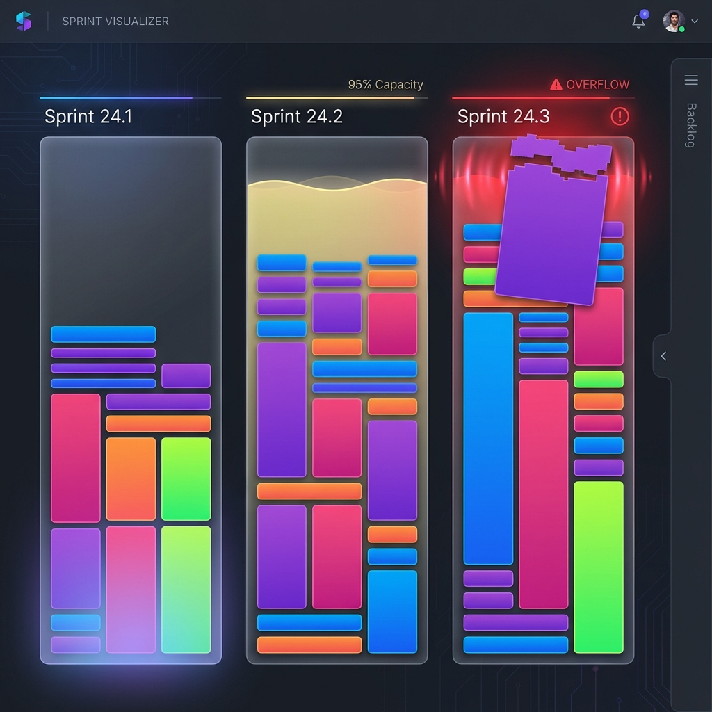

# Capacity Visualization Analysis

## Problem Statement
The leadership team often pushes for more work into sprints without a clear visualization of capacity. This leads to:
- Management overhead.
- High context switching.
- Team stress and burnout due to overcommitment.

## Goal
Create a user-friendly visualization tool for leadership ("SLT Viz Board") that clearly demonstrates:
- Current sprint capacity vs. workload.
- The "physical" space tasks take up (Task Size = Complexity/Points).
- Clear warning signs when a sprint is overstuffed.

## Proposed Solution: "Sprint Tetris" / "Tweek for Sprints"
### UI Concept

- **Base Inspiration**: [Tweek.so](https://tweek.so) (Minimalist weekly planner) Desktop view.
- **Structure**:
    - Instead of **Days** (Mon, Tue, Wed...), columns represent **Sprints** (Sprint 1, Sprint 2, Sprint 3...).
    - **Vertical Axis**: Represents **Capacity** (Total Story Points available).
    - **Cards**: Represent **Tasks/Features**.
    - **Visual Logic**:
        - Card Height is directly proportional to Story Points.
        - If the stack of cards exceeds the column height, it visually overflows (red zone/warning), making "overcapacity" immediately obvious.

### Secondary UI Inspiration
- **Fizzy** (New release): Kanban style, polished UI. Note elements like corner radii, typography, or drag-and-drop feel, even if the logic (Kanban) doesn't fit the Sprint constraint.

## Data Source
- **Primary Source**: Asana.
- **Integration Needs**:
    - **Sprint Definition**: Tasks are tagged via a **Custom Field (Multi-select Checkbox)**. A task can belong to multiple sprints.
    - **Capacity Metric**: Story Points (0.5 minimum increment).
    - **Sync Strategy**: 
        - Phase 1: Read-only dashboard.
        - Phase 2: "Push to Asana" button (Batch update). *Not real-time.*
- **Development Data**:
    - Use a `mock_tasks.csv` to simulate data structure during early dev.

### 6. The Backlog
- Needs a dedicated column/area.
- Requirements: "Show as minimized sprint".
    - Interpretation: A narrower or collapsible column.
    - Tasks might not need full "height = points" visualization here, or perhaps they do but are tightly packed.
    - Must handle items with *no* sprint tag.

---

## Brainstorming & Data Model

### 1. The "Container" (Sprint Column)
Each column needs a defined limit.
- **Properties**:
    - `sprintName` (e.g., "Sprint 24.1")
    - `startDate`, `endDate`
    - `totalCapacity` (e.g., 40 Points) -> This determines the pixel height of the column (e.g., 40pts = 800px).
    - `currentLoad` (Sum of points of cards inside).

### 2. The "Item" (Task Card)
- **Properties**:
    - `title`
    - `asanaId`
    - `points` (Cost).
    - `assignee` (Optional, maybe color-coded avatars).
    - `status` (To show if we are carrying over finished work?).
- **Visuals**:
    - Height = `points` * `pixels_per_point`.
    - 1 Point = 20px (example).
    - 5 Point task = 100px tall (Big block).
    - 0.5 Point task = 10px tall (Sliver).

### 3. Asana Mapping
How do we identify Sprints in Asana?
- **Scenario A**: Asana "Sprints" feature (if using robust Agile template).
- **Scenario B**: Custom Dropdown Field ("Sprint 1", "Sprint 2").
- **Scenario C**: Separate Sections in a Board View.
*Decision*: We need to ask the user how their Asana is structured. We will assume a flexible adapter pattern.

### 4. Technical Stack (Web App)
- **Frontend**: Next.js (React) + TailwindCSS.
- **State Management**: Zustand (for dragging/moving cards).
- **Drag & Drop**: `@dnd-kit/core` or `react-beautiful-dnd`.
- **API**: Asana Node Client.

### 5. UI "Wow" Factors (The "Premium" Feel)
- **Glassmorphism**: Subtle backgrounds for columns.
- **Fluid transitions**: When a card is dropped, the stack should adjust smoothly (spring physics).
- **Capacity Indicator**: A subtle water-level or progress bar background in the column that turns gradient red as it hits 100%.
- **"The Overflow"**: If a column is at 105% capacity, the top card shouldn't just disappear; it should look like it's "spilling over" or have a jagged "break" line.

### 7. UI Component Architecture (Draft)
- **`BoardLayout`**: Main container. Horizontal scrollable area.
- **`SprintColumn`**:
    - Props: `sprintName`, `capacity`, `tasks[]`.
    - Visuals: Fixed width (e.g., 300px).
    - Logic: Calculates total points. Renders `TaskCard`s stacked.
    - **`CapacityBackground`**: A distinct layer behind tasks that shows the "water level" (e.g., green up to 90%, yellow 90-100%, red > 100%).
- **`TaskCard`**:
    - Props: `task`.
    - Visuals: 
        - Height = `task.points * 20px`. (Min height for 0.5 pts = 10px).
        - Color: Based on assignee or project (TBD).
        - Content: Title (truncated if small), Points badge.
- **`BacklogSidebar`**:
    - Collapsible panel on the left/right.
    - specialized "compact" view. Maybe `CompactTaskCard` (fixed height).

### 8. Visualization Logic
- **Scaling**:
    - Base Unit: 1 Point = `Y` pixels.
    - Let's say a standard 1080p screen has ~800px usable height minus headers/footers.
    - If typical sprint capacity is 40 points, then 800px / 40pts = 20px per point.
    - This seems reasonable.
    - *Configuration*: We might need a "Zoom Level" slider to adjust `pixels_per_point` if sprint capacities vary wildly (e.g., a 100 pt sprint).

### 9. State Management (Zustand Store)
- `files/raw_csv`: The raw input.
- `sprints`: Map<SprintName, Task[]>.
- `backlog`: Task[].
- `dragOperation`: Currently dragging item.
- Actions: `moveTask(taskId, fromSprint, toSprint, newIndex)`.

## Future Features (Post-MVP)
- **Filters**: Filter board by Assignee.
- **Sprint Management**: Dedicated page to set capacity per sprint and per analyst.
- **Task Details**: Modal/Sidebar to view full task details on click.
- **Asana Integration**: Real-time sync.

